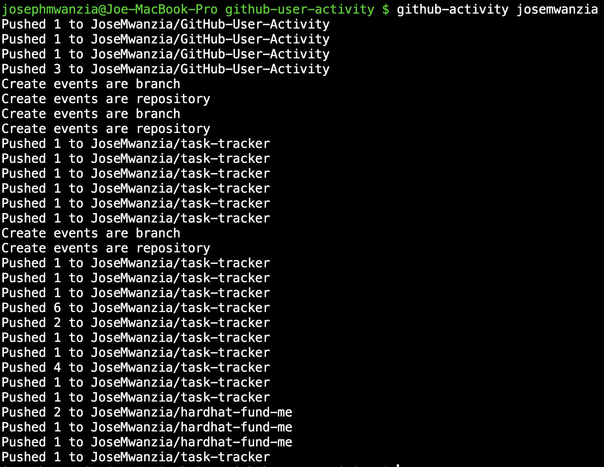

# GitHub User Activity

In this project, I built a simple command line interface (CLI) to fetch the recent activity of a GitHub user and display it in the terminal. This project utilized working with APIs, handling JSON data, and building a simple CLI application.

You can challenge yourself by creating one [GitHub User Activity](https://roadmap.sh/projects/github-user-activity).
## Badges

Add badges from: [shields.io](https://shields.io/)


## Installation

To get started with this project, follow these steps:

NOTE: You need to have [node.js](https://nodejs.org/en/learn/getting-started/how-to-install-nodejs) installed in your local machine for this to work.

1. CLone the repository, you can use http or SSH, 
```bash
    git clone git@github.com:JoseMwanzia/GitHub-User-Activity.git
```

```bash
    cd github-user-activity
```

2. Navigate to your repository.
```bash
    cd github-user-activity
```

3. Install the dependencies on your local machine globally. Make sure you have Nose.js installed.
```bash
    npm install -g . // to install the bin in package.json
```

4. You can start the project with:
```bash
    github-user-activity <username>
```
In the ``<username>`` provide a valid github username.

## Screenshots



## License

[MIT](https://choosealicense.com/licenses/mit/)

